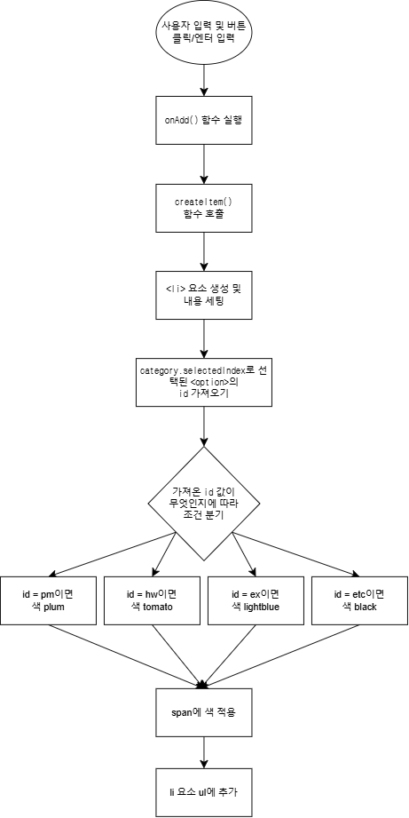
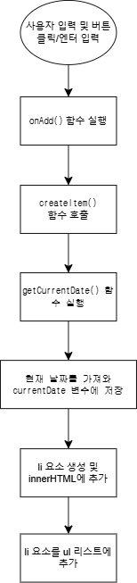

# ToDoList

---

## 추가된 기능 1

### 카테고리 선택에 따른 글자 색상 자동 적용

**사용자가 약속, 과제, 운동, 기타 중 하나의 카테고리를 선택하고 할 일을 추가하면, 그 할 일 항목의 글자 색상이 자동으로 정해지는 기능**

- 약속(pm)은 연보라색(plum)
- 과제(hw)는 토마토색(tomato)
- 운동(ex)은 연한 파란색(lightblue)
- 기타(etc)는 검은색(black)

** 리스트를 보자마자 카테고리를 시각적으로 알 수 있는 장점 **

---

## 추가된 기능 2

### 할 일을 등록할 때의 날짜 표시

**사용자가 입력창에 할 일을 작성하고 추가하면, 그 항목에 자동으로 등록한 날짜가 함께 표시되는 기능**

- 날짜는 `@월 @일` 형식

** 언제 리스트를 추가했는지 바로 알 수 있어 할 일을 효율적으로 관리 **

---

### 기능 1에 대한 플로우차트

### 기능 2에 대한 플로우차트

